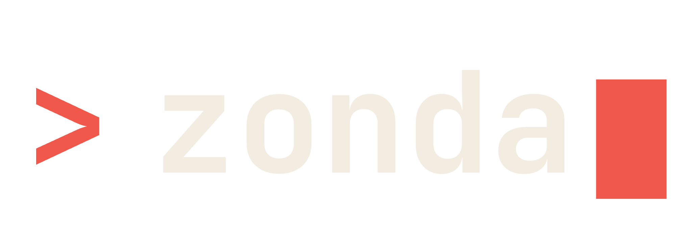

<p align="center"></p>

A CLI that lets you build Laravel packages without a host Laravel app. Run `zonda` commands from inside a package directory and Zonda transparently boots a Laravel sandbox, links your package into it, and runs `artisan` against it — so package work feels like working inside a regular Laravel project.

Built on [Laravel Zero](https://laravel-zero.com/).

## How it works

1. `zonda new vendor/name` scaffolds a package skeleton (composer.json, ServiceProvider, Pest tests, etc.) and pins it to one **or several** Laravel majors (9–13).
2. Inside that package, `zonda make:*` writes files directly into `src/`, `database/`, `resources/`, `tests/` — no sandbox round-trip, fast and offline.
3. `zonda artisan <anything>` lazily creates a sandbox at `~/.zonda/sandboxes/laravel-{N}/` (one per Laravel major), wires the package in via a Composer path repository + symlink, and runs `php artisan` there. A package pinned to multiple majors uses the highest by default; `--laravel=N` switches to any other pinned version.
4. `zonda test` runs Pest/PHPUnit inside the package itself against its own `vendor/`.

A package is identified by `extra.zonda.package: true` in its `composer.json`. Supported Laravel majors live at `extra.zonda.laravel` as an array (e.g. `[10, 11, 12]`); a single int is also accepted for backward compatibility. Sandboxes are version-keyed, so a Laravel 10 package and a Laravel 13 package coexist with their own installs and don't fight over composer state.

## Requirements

- PHP `^8.2`
- Composer on `PATH` (used to build sandboxes)

## Install

### Composer global

```bash
composer global require laramint/laravel-zonda -W
```

The `-W` (`--with-all-dependencies`) flag is recommended: Composer's global namespace often has other CLIs installed that pin `illuminate/*` to older majors, and without `-W` you'll see errors like *"fixed to v11.x (lock file version) by a partial update"*. `-W` lets Composer upgrade those locked transitive deps to satisfy Zonda's requirements.

Make sure Composer's global `bin` is on your `PATH` (usually `~/.composer/vendor/bin` or `~/.config/composer/vendor/bin`), then:

```bash
zonda --help
```

If you'd rather not touch your global Composer state at all, use the [PHAR install](#phar) below — it's self-contained and won't conflict with anything.

### PHAR

Download the latest release directly:

```bash
curl -L https://github.com/laramint/laravel-zonda/releases/latest/download/zonda -o zonda
chmod +x zonda
sudo mv zonda /usr/local/bin/zonda
zonda --version
```

To pin a specific version, replace `latest/download` with `download/vX.Y.Z`:

```bash
curl -L https://github.com/laramint/laravel-zonda/releases/download/v0.1.0/zonda -o zonda
```

Or browse the [GitHub releases](https://github.com/laramint/laravel-zonda/releases) page and grab the `zonda` asset manually.

## Quickstart

```bash
zonda new acme/widget --laravel=12     # scaffold a package pinned to Laravel 12
cd widget
zonda make:command SayHello             # writes src/Console/Commands/SayHello.php
zonda make:model Post                   # writes src/Models/Post.php
zonda make:migration create_posts_table # writes database/migrations/<timestamp>_create_posts_table.php
zonda artisan migrate                   # boots the L12 sandbox, links the package, runs artisan migrate
zonda test                              # runs Pest in the package
```

## Commands

### Top-level

| Command | Purpose |
|---|---|
| `zonda new <vendor/name> [--laravel=N[,N,...]] [--path=...]` | Scaffold a new package. Shows a multi-select prompt of Laravel 9–13 if `--laravel` is omitted; pass `--laravel=12` for a single version or `--laravel=10,11,12` for a multi-version package. |
| `zonda artisan <args...> [--laravel=N]` | Run `php artisan` inside the version-matched sandbox with the current package linked. When the package pins multiple majors, the highest is used by default; `--laravel=N` picks a different pinned major. The sandbox is created on first use. |
| `zonda test <args...>` | Run the package's own test suite (Pest preferred, PHPUnit fallback). Runs `composer install` in the package on first use. |
| `zonda update [--check] [--force]` | Replace the running Zonda PHAR with the latest GitHub release. Aliased to `zonda self-update`. Composer-installed users should use `composer global update laramint/laravel-zonda -W` instead — the command detects that and tells you. |
| `zonda resync [--laravel=N] [--all] [--reset]` | Re-link the current package into its sandbox(es). Useful after moving the package directory or when the sandbox got into a weird state. `--all` covers every pinned Laravel major; `--reset` deletes the sandbox first and rebuilds it. |

### Generators (`make:*`)

All generators are run from inside a package directory and write into the package itself. Most accept a single `{name}` argument and a `--force` flag to overwrite an existing file. Names like `Blog/Post` or `Blog\Post` create subfolders/sub-namespaces.

| Command | Target | Notes |
|---|---|---|
| `make:command <Name>` | `src/Console/Commands/<Name>.php` | Signature defaults to the kebab-cased class name. |
| `make:controller <Name>` | `src/Http/Controllers/<Name>.php` | |
| `make:model <Name>` | `src/Models/<Name>.php` | |
| `make:provider <Name>` | `src/Providers/<Name>.php` | |
| `make:migration <name>` | `database/migrations/<ts>_<name>.php` | Timestamped. Guesses the table name from `create_<table>_table`. |
| `make:request <Name>` | `src/Http/Requests/<Name>.php` | FormRequest with `authorize` + `rules`. |
| `make:resource <Name>` | `src/Http/Resources/<Name>.php` | JsonResource. |
| `make:factory <Name> [--model=]` | `database/factories/<Name>Factory.php` | `--model` controls the FQN in `use` / `$model`. |
| `make:seeder <Name>` | `database/seeders/<Name>Seeder.php` | |
| `make:middleware <Name>` | `src/Http/Middleware/<Name>.php` | |
| `make:job <Name>` | `src/Jobs/<Name>.php` | Implements `ShouldQueue`. |
| `make:event <Name>` | `src/Events/<Name>.php` | Uses `Dispatchable` + `SerializesModels`. |
| `make:listener <Name> [--event=]` | `src/Listeners/<Name>.php` | `--event=Pinged` resolves to `{Namespace}\Events\Pinged`; pass a FQN to point elsewhere. |
| `make:mail <Name>` | `src/Mail/<Name>.php` | Mailable with `envelope`/`content`/`attachments`. |
| `make:notification <Name>` | `src/Notifications/<Name>.php` | |
| `make:policy <Name> [--model=]` | `src/Policies/<Name>.php` | |
| `make:test <Name> [--unit]` | `tests/Feature/<Name>Test.php` (or `tests/Unit/...`) | Pest by default. |
| `make:view <dot.or/slash.name>` | `resources/views/<...>.blade.php` | Both `admin.users.index` and `admin/users/index` work. |
| `make:config [name]` | `config/<name>.php` | `name` defaults to the package's short name, matching what the generated ServiceProvider auto-merges. |

## The generated package

`zonda new` produces a skeleton with:

```
acme/widget/
├── composer.json
├── README.md
├── phpunit.xml.dist
├── src/
│   └── WidgetServiceProvider.php
└── tests/
    ├── ExampleTest.php
    ├── Pest.php
    └── TestCase.php
```

`composer.json` carries the markers Zonda needs:

```json
{
    "extra": {
        "zonda": { "package": true, "laravel": [10, 11, 12] },
        "laravel": { "providers": ["Acme\\Widget\\WidgetServiceProvider"] }
    }
}
```

The pinned majors drive:

- which sandbox `zonda artisan` runs against (highest by default, overridable with `--laravel=N`)
- the `illuminate/support` constraint — `^10.0|^11.0|^12.0` for the example above
- the matching `orchestra/testbench` constraint (union from the version matrix)

A package pinned to a single major still works exactly the same — `extra.zonda.laravel: 12` and `extra.zonda.laravel: [12]` are both accepted, and resolve to a one-element major set.

#### Testing against every pinned version

Because each pinned major has its own sandbox, you can sanity-check your package end-to-end on the whole matrix:

```bash
zonda artisan --laravel=10 list
zonda artisan --laravel=11 list
zonda artisan --laravel=12 list
```

Each run uses its dedicated `~/.zonda/sandboxes/laravel-{N}/` install with your package linked in.

### Auto-loading ServiceProvider

The generated `ServiceProvider` is conventions-aware: it auto-registers anything it finds on disk, so you can just run `make:view`, `make:config`, `make:migration`, etc. and the loader picks them up without you editing the provider. What gets wired up if it exists:

| Path | What happens |
|---|---|
| `config/<shortName>.php` | `mergeConfigFrom(..., '<shortName>')` in `register()`; publishable as tag `<shortName>-config`. |
| `database/migrations/` | `loadMigrationsFrom(...)`; publishable as tag `<shortName>-migrations`. |
| `resources/views/` | `loadViewsFrom(..., '<shortName>')`; publishable as tag `<shortName>-views`. |
| `resources/lang/` (or `lang/`) | `loadTranslationsFrom(..., '<shortName>')`; publishable as tag `<shortName>-lang`. |
| `routes/web.php` / `routes/api.php` / `routes/console.php` | `loadRoutesFrom(...)` for each that exists. |

`<shortName>` is the package's kebab name (e.g. `acme/widget` → `widget`). The provider uses `dirname(__DIR__)` to find the package root, which is correct because it lives at `src/<ProviderClass>.php`.

## The sandbox

State lives under `~/.zonda/sandboxes/laravel-<N>/`:

```
~/.zonda/sandboxes/
├── laravel-10/         # full Laravel 10 install (only created on first L10 zonda artisan)
│   ├── composer.json   # has a path repo + require pointing at your package
│   └── state.json      # { "linked": "/path/to/the/currently-linked/package" }
├── laravel-12/
└── laravel-13/
```

`zonda artisan ...` is the only command that needs the sandbox; `make:*` and `new` are offline. Linking is cached in `state.json`, so repeated artisan calls from the same package don't re-run `composer update`.

To rebuild from scratch you can use the dedicated command, which is safer than `rm -rf` because it also re-links the package immediately:

```bash
zonda resync --reset              # nuke + rebuild the default-pinned sandbox
zonda resync --reset --all        # do that for every pinned Laravel major
```

Or, equivalently, the manual route:

```bash
rm -rf ~/.zonda/sandboxes/laravel-12   # forces a fresh L12 sandbox on next zonda artisan
```

### What if I move the package directory?

You usually don't need to do anything — `zonda artisan ...` detects that `state.json`'s cached path no longer matches the current package root, drops the stale path-repo entry from the sandbox's `composer.json`, writes the new one, runs `composer update <vendor/name>`, and updates `state.json`. Next call is back to the fast path.

If that auto-heal doesn't kick in (e.g. you have two clones of the same package and the state happens to match the wrong one, or the sandbox's vendor tree got corrupted), force it explicitly:

```bash
cd /new/location/of/the/package
zonda resync                # forces a fresh link from this directory
zonda resync --all          # do it for every pinned Laravel major
zonda resync --reset        # nuke the sandbox first, then re-link
```

## Adding your own top-level commands

Drop a class under `app/Commands/` extending `LaravelZero\Framework\Commands\Command`. Laravel Zero auto-discovers it.

```php
namespace App\Commands;

use LaravelZero\Framework\Commands\Command;

class DoThingCommand extends Command
{
    protected $signature = 'do:thing {name} {--force}';
    protected $description = 'Do a thing.';

    public function handle(): int
    {
        $this->info("Doing {$this->argument('name')}");
        return self::SUCCESS;
    }
}
```

For new `make:*` generators, extend `App\Support\AbstractMakeCommand` and implement `stubName()`, `relativeTargetPath()`, and `replacements()`. Use `$this->parseName($name)` for free `Blog/Post` subfolder support, and `$this->targetNamespace(...)` / `$this->targetPath(...)` to compose the namespace and file path.

## Updating

### PHAR install

```bash
zonda update          # download and replace the running PHAR
zonda update --check  # just compare current vs. latest, don't download
zonda update --force  # re-download even if already on the latest version
```

How it works: the command fetches `releases/latest` from the GitHub API to learn the newest tag, compares it to the version baked into the PHAR (`zonda --version`), then downloads the `zonda` asset for that tag into `<binary-path>.new`, sanity-checks that it's a real PHAR, sets it executable, and renames it over the running binary. The rename is atomic on Unix — the in-memory PHP process keeps running off the old inode, and the next invocation picks up the new file.

If the binary lives somewhere root-owned (`/usr/local/bin/zonda` is typical), you'll need:

```bash
sudo zonda update
```

### Composer global install

```bash
composer global update laramint/laravel-zonda -W
```

Running `zonda update` on a Composer install will detect that case and print this command for you — it won't try to overwrite Composer-managed files.

## Build the PHAR locally

```bash
php zonda app:build zonda --build-version=0.1.0
# → builds/zonda
```

If you get `Failed to compile the application.`, your PHP has `phar.readonly=On` (the default on most distros and Homebrew). Two ways to fix it:

```bash
# Quick: permanently flip it in your loaded php.ini
php -r 'echo php_ini_loaded_file().PHP_EOL;'
# edit that file → set:  phar.readonly = Off

# Or build via box directly (no wrapper subprocess to worry about):
php -d phar.readonly=0 vendor/laravel-zero/framework/bin/box compile --config=box.json
```

CI doesn't hit this — the release workflow sets `phar.readonly=Off` explicitly via `shivammathur/setup-php`.

## Development

```bash
git clone https://github.com/laramint/laravel-zonda.git
cd laravel-zonda
composer install
./vendor/bin/pest
```

## License

MIT
